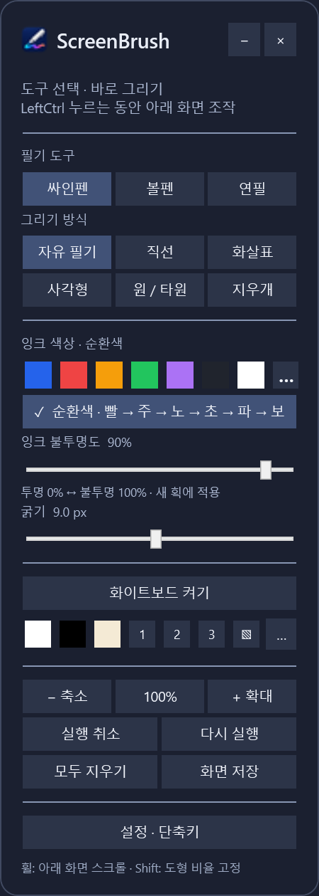
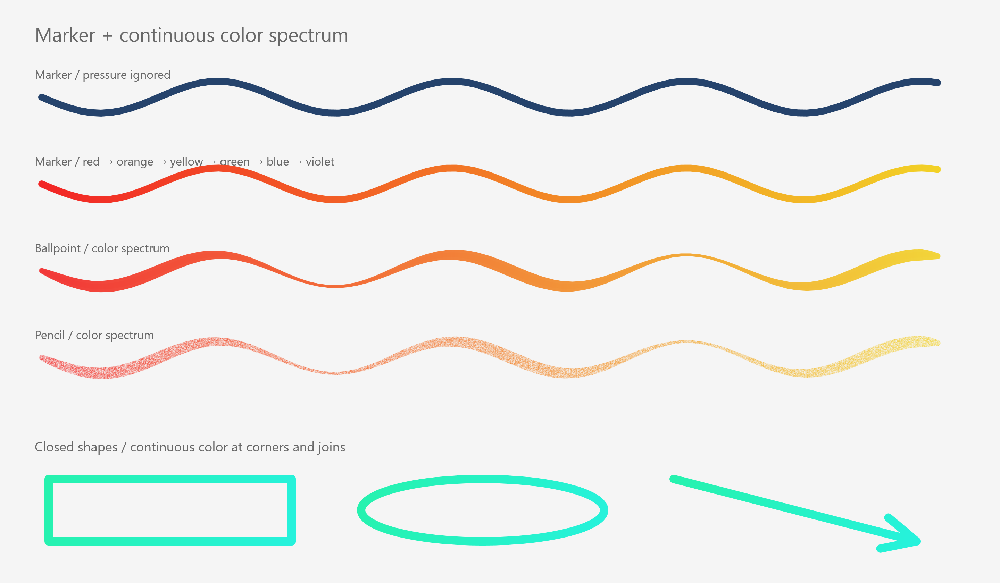
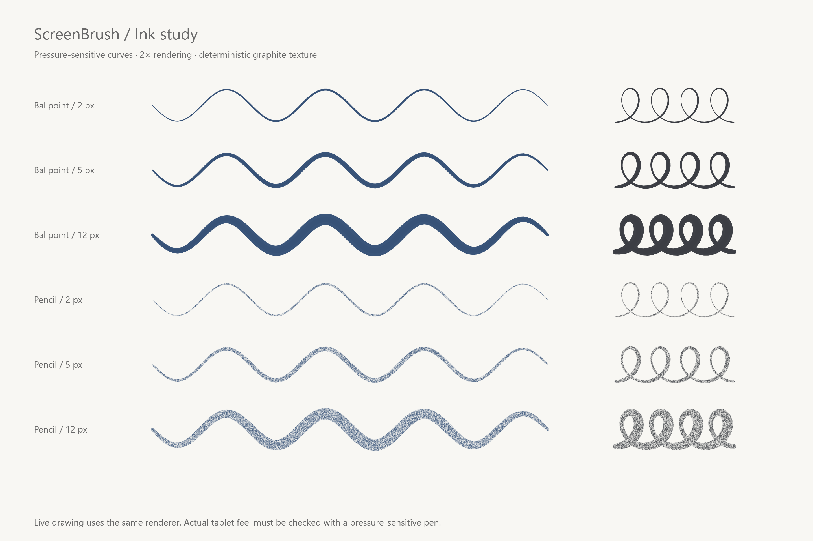
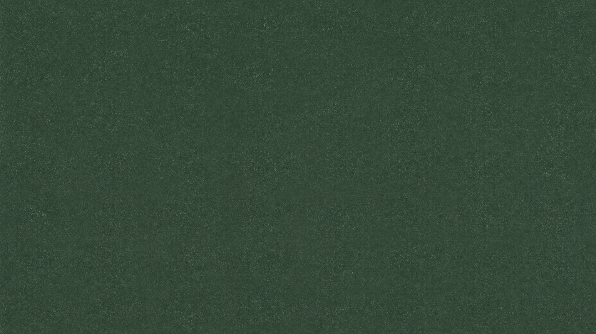
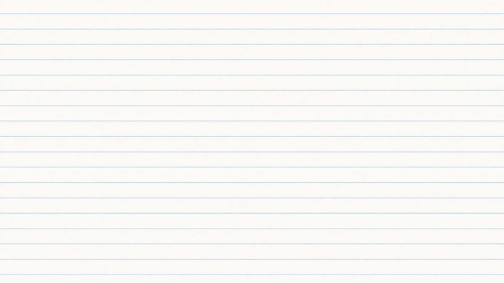
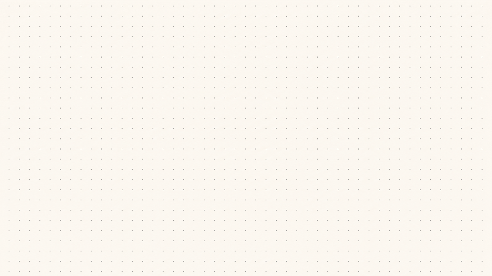
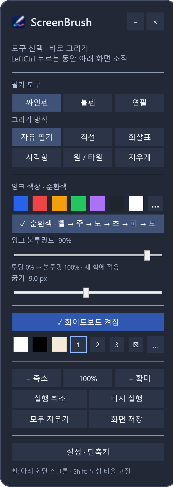
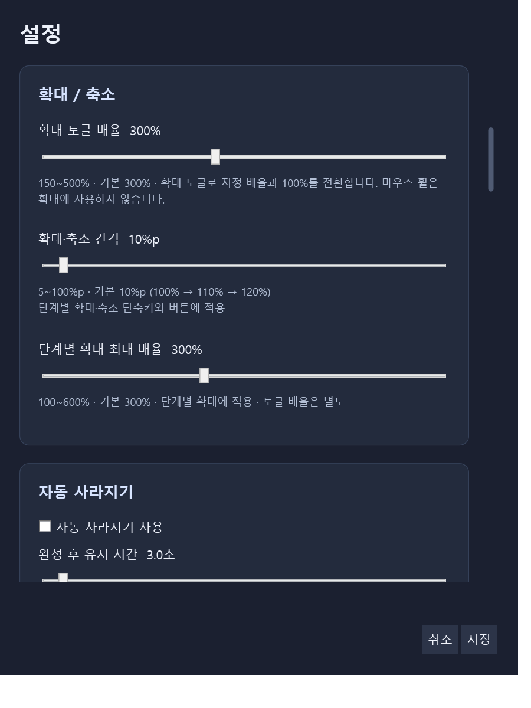
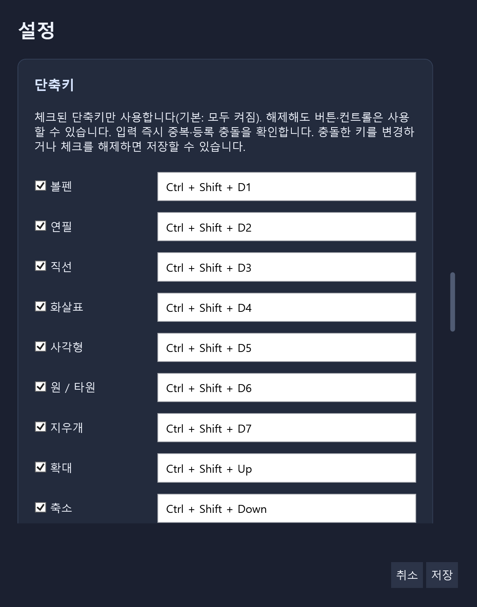
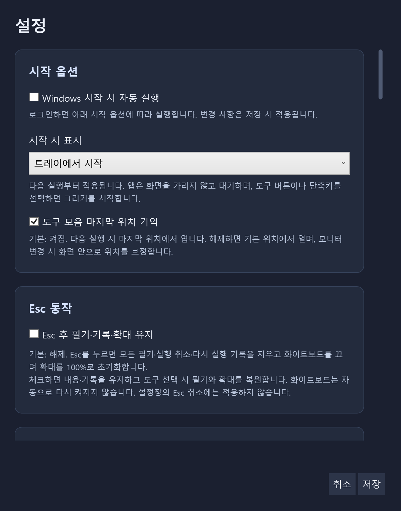

# ScreenBrush

**지금 보고 있는 화면 위에 쓰고, 그리고, 강조하세요.**

ScreenBrush는 Windows 화면 위에 필기와 도형을 더하는 데스크톱 앱입니다. 발표 자료에 화살표를 표시하거나, 화이트보드에 아이디어를 정리하고, 화면과 필기를 PNG로 저장할 수 있습니다.

<table>
  <tr><th>도구 모음</th><th>세 가지 펜과 순환색</th></tr>
  <tr>
    <td valign="top" width="28%"></td>
    <td valign="top"><br><sub>앱에서 사용하는 필기 렌더러로 만든 예시입니다.</sub></td>
  </tr>
</table>

[빠른 시작](#빠른-시작) · [필기와 색상](#필기와-색상) · [화이트보드](#화이트보드) · [확대와 화면 조작](#확대와-화면-조작) · [단축키](#단축키) · [빌드](#빌드)

## 빠른 시작

1. 배포 폴더의 **`ScreenBrush.exe`**를 실행합니다. 기본 설정에서는 트레이에서 시작합니다.
2. 알림 영역의 **ScreenBrush 아이콘을 더블클릭**하거나 **`Ctrl+Shift+F1`**로 도구 모음을 엽니다.
3. **싸인펜·볼펜·연필** 중 하나와 **자유 필기·직선·화살표·사각형·원/타원** 중 그리기 방식을 선택합니다.
4. 화면 위에 그립니다. 색상, 굵기, 불투명도는 도구 모음에서 조절합니다.
5. 남기고 싶은 화면은 **`Ctrl+Shift+S`**로 PNG로 저장합니다.

> **아래 화면으로 돌아가려면 `Esc`를 누르세요.** 기본 설정에서는 필기와 실행 취소·다시 실행 기록을 지우고, 화이트보드를 끄며 배율을 100%로 되돌립니다. 내용을 유지하려면 **설정 · 단축키 → Esc 후 필기·기록·확대 유지**를 켜세요.

| 하고 싶은 일 | 조작 |
| --- | --- |
| 잠깐 아래 앱을 클릭하거나 조작하기 | **왼쪽 Ctrl**을 누른 채 조작 |
| 도구 모음 이동 | 제목을 드래그 |
| 도구 모음을 트레이로 숨기기 | 제목줄의 **−** |
| 앱 종료 | 제목줄의 **×** 또는 **Alt+F4** |

## 필기와 색상

### 펜의 느낌과 도형을 조합하기

**필기 도구**와 **그리기 방식**은 각각 선택합니다. 볼펜으로 화살표를 그리거나, 연필로 사각형을 그리는 식으로 조합할 수 있습니다.

| 도구 | 표현 |
| --- | --- |
| 싸인펜 | 일정한 굵기의 선으로 강조 |
| 볼펜 | 필압에 따라 굵기가 달라지는 선 |
| 연필 | 입자감이 있는 선과 필압 표현 |
| 지우개 | 그린 필기 지우기 |



*동일한 렌더러로 만든 굵기·필압 비교 예시입니다. 실제 필압 입력은 사용하는 펜과 장치에 따라 달라집니다.*

### 단색부터 순환색까지

- **기본 7색**과 **사용자 색상**을 선택할 수 있습니다.
- **순환색**을 켜면 한 획 안에서 빨강 → 주황 → 노랑 → 초록 → 파랑 → 보라로 색이 이어집니다.
- **굵기와 불투명도**를 조절하고, 설정에서 순환색의 변화 속도를 바꿀 수 있습니다.
- 일반 화면과 화이트보드에서 사용하는 **도구별 색상은 각각 기억**합니다.
- **실행 취소·다시 실행**과 **모두 지우기**로 필기를 정리합니다.

## 화이트보드

**`Ctrl+Alt+B`** 또는 도구 모음의 **화이트보드 켜기**로 배경을 펼칩니다. 흰색·검정·사용자 색상과 세 가지 내장 배경, 사용자 이미지를 지원합니다.

<table>
  <tr><th>칠판 · 1</th><th>노트 · 2</th><th>도트 · 3</th></tr>
  <tr>
    <td></td>
    <td></td>
    <td></td>
  </tr>
</table>

*앱에 포함된 화이트보드 배경 미리보기입니다. 도구 모음의 1·2·3 버튼으로 선택합니다.*

<details>
<summary><strong>화이트보드가 켜진 도구 모음 보기</strong></summary>

<p></p>

</details>

사용자 이미지는 **설정 · 단축키 → 화이트보드 · 사용자 이미지**에서 지정합니다. 앱을 다시 실행하면 화이트보드는 꺼진 상태로 시작하며, `Esc` 후 필기 유지 옵션을 사용하더라도 화이트보드는 직접 다시 켜야 합니다.

## 확대와 화면 조작

작은 글씨나 세부 내용을 설명할 때 화면과 필기를 함께 확대할 수 있습니다.

| 조작 | 동작 |
| --- | --- |
| **Shift + 마우스 휠** | 확대·축소 |
| **오른쪽 버튼 드래그** | 확대된 화면 이동 |
| **Ctrl+Shift+0** | 원래 배율로 복귀 |
| **왼쪽 Ctrl 누르기** | 누르는 동안 아래 화면 조작 |

확대 간격은 기본 **10%p**, 최대 배율은 기본 **300%**입니다. 설정에서 휠 보조키와 간격을 바꾸고 최대 배율을 **600%**까지 지정할 수 있습니다.

<p align="center"></p>

### 자동 사라지기

발표 중 잠깐 표시할 때 사용합니다. 켜면 완성된 획 전체가 기본 **3초간 유지**된 뒤 **1.5초 동안 흐려지며 사라집니다**. 기본값은 꺼짐이며, 유지 시간과 사라지는 시간은 설정에서 조절합니다.

**`Ctrl+Alt+Shift+A`**로 켜거나 끌 수 있습니다.

## 화면 저장

**화면 저장** 버튼 또는 **`Ctrl+Shift+S`**를 누르면 화면과 필기를 **PNG**로 저장합니다.

- 기본 저장 폴더: Windows **사진 폴더 아래 `ScreenBrush`**
- 기본 파일명: **`screenbrush_날짜시간.png`** — 예: `screenbrush_20260925143005.png`
- 같은 이름의 파일이 있으면 번호를 덧붙여 보존합니다.
- 설정에서 **저장 폴더**와 **자동 파일명 사용 여부**를 바꿀 수 있습니다.

앱 종료 후에도 남길 필기는 종료 전에 PNG로 저장하세요.

## 단축키

아래는 기본 단축키입니다. **설정 · 단축키**에서 변경하거나 개별 단축키만 끌 수 있습니다. 단축키를 꺼도 해당 버튼은 계속 사용할 수 있고, 키를 변경하면 중복·등록 충돌을 바로 확인합니다.

| 기능 | 기본 단축키 |
| --- | --- |
| 도구 모음 표시 / 숨기기 | `Ctrl+Shift+F1` |
| 자유 필기 | `Ctrl+Shift+F` |
| 볼펜 / 연필 | `Ctrl+Shift+1` / `Ctrl+Shift+2` |
| 직선 / 화살표 | `Ctrl+Shift+3` / `Ctrl+Shift+4` |
| 사각형 / 원·타원 | `Ctrl+Shift+5` / `Ctrl+Shift+6` |
| 지우개 / 싸인펜 | `Ctrl+Shift+7` / `Ctrl+Shift+8` |
| 순환색 켜기 / 끄기 | `Ctrl+Shift+9` |
| 실행 취소 / 다시 실행 | `Ctrl+Z` / `Ctrl+Y` |
| 모두 지우기 | `Ctrl+Shift+Delete` |
| 확대 / 축소 | `Ctrl+Shift+↑` / `Ctrl+Shift+↓` |
| 원래 배율 | `Ctrl+Shift+0` |
| 화이트보드 켜기 / 끄기 | `Ctrl+Alt+B` |
| 자동 사라지기 켜기 / 끄기 | `Ctrl+Alt+Shift+A` |
| 화면 저장 | `Ctrl+Shift+S` |
| 아래 화면 조작으로 돌아가기 | `Esc` |
| 앱 종료 | `Alt+F4` |

<details>
<summary><strong>색상·배경 단축키와 설정 화면 보기</strong></summary>

| 번호 | 잉크 색상 · `Ctrl+Alt+번호` | 배경 · `Ctrl+Alt+Shift+번호` |
| --- | --- | --- |
| 1 | 파랑 | 흰색 |
| 2 | 빨강 | 검정 |
| 3 | 주황 | 사용자 색 |
| 4 | 초록 | 칠판 |
| 5 | 보라 | 노트 |
| 6 | 검정 | 도트 |
| 7 | 흰색 | 사용자 이미지 |

<p></p>

설정 화면의 `D1`~`D9`는 키보드 위쪽 숫자 키를 뜻합니다.

</details>

## 시작 옵션과 설정 보관

Windows 로그인 시 자동 실행, 트레이 또는 도구 모음에서 시작, 도구 모음의 마지막 위치 기억, `Esc` 후 필기 유지 여부를 설정할 수 있습니다.

<p align="center"></p>

개인 설정은 다음 파일에 저장됩니다.

```text
%LOCALAPPDATA%\ScreenBrush\settings.json
```

다른 PC로 앱을 옮길 때는 **배포 폴더 전체**를 복사하세요. 설정 파일은 사용자별로 별도 저장됩니다.

## 빌드

**Windows x64**와 **.NET 10 SDK**가 필요합니다. 저장소 루트에서 실행합니다.

```powershell
powershell -ExecutionPolicy Bypass -File .\build.ps1
```

결과는 **`artifacts/ScreenBrush/`**에 생성됩니다.

```powershell
.\artifacts\ScreenBrush\ScreenBrush.exe
```

기본 빌드는 .NET 런타임을 포함하지 않으므로, 실행할 PC에는 **.NET 10 Desktop Runtime (x64)** 또는 해당 SDK가 필요합니다.

<details>
<summary><strong>검증과 필기 예시 생성</strong></summary>

```powershell
# 기본 검사 후 빌드
powershell -ExecutionPolicy Bypass -File .\build.ps1 -Check

# 실제 데스크톱에서 UI·입력 동작 검사
powershell -ExecutionPolicy Bypass -File .\build.ps1 -DesktopCheck

# 앱 렌더러로 필기 예시 PNG 생성
powershell -ExecutionPolicy Bypass -File .\build.ps1 -Samples
```

필기 예시는 `artifacts/brush-samples.png`와 `artifacts/new-tools.png`에 생성됩니다.

</details>
